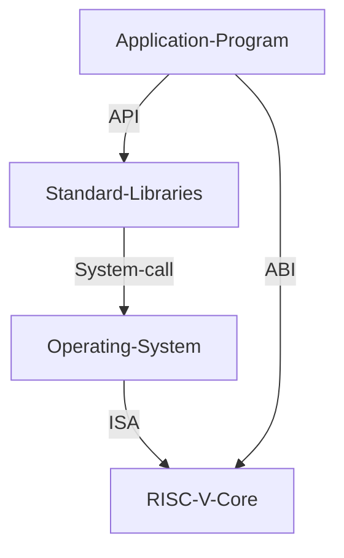
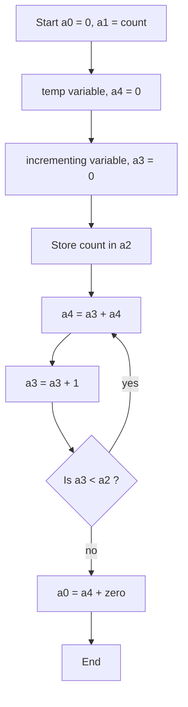
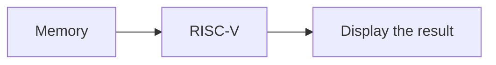

## Day 2 - Application Binary Interface and verification flow

### Application Binary Interface (ABI)

#### Intro to ABI


- ABI is the system-call interface present between the software application and the registers of the ISA
- It can be used to access the registers through system calls



- There are 32 registers each of 64 bits in the RV64.

#### Memory Allocation for double words

- Memory is **byte-addressable**
- Each address contains 8 - bits (i.e.) - 1 byte
- RISC - V follows little-endian memory system.
- MSB bits have higher memory address and LSB have lower memory address

#### Load, Add and Store instructions


#### RV64I registers and their ABI Names

- Load, add and store belong to $RV64I$ base instructions.
- Load is a I-type instruction
- Add is a R-type instruction
- Store is a S-type instruction
- $rd$ is of size 5 bits => So $2^5 = 32$ registers
- Naming convention is $x0$ to $x31$


### Labs using ABI function call

#### Sum of N numbers Flowchart



- Value of a0 is returned to the main program.

#### Assembly Function Call

##### Assembly code for the sum of N

```assembly
.section .text
.global load
.type load, @function

load:
  add a4, a0, zero // a4 - sum register
  add a2, a0, a1   // a2 - count register, n
  add a3, a0, zero // a3 - intermediate register, i
  
loop:
  add a4, a3, a4 // add a3 to a4 every loop
  add a3, a3, 1  // increment a3 by 1
  blt a3, a2, loop // loop back as long as i < n
  add a0, a4, zero // store result in a0
  ret  
```

##### C program to call the assembly code

```c
#include <stdio.h>

extern int load(int x, int y);

int main () {
 int result = 0;
 int count = 10;
 result = load(0x0, count+1);
 printf("Sum of numbers from 1 to %d is %d\n", count, result);
 return 0;
} 
```


##### Compiling through a RISC-V core

```console
riscv64-unknown-elf-gcc -Ofast -mabi=lp64 -march=rv64i -o sumof_N.o sumof_N.c load.S
spike pk sumof_N.o
```


### Passing the C program as a HEX file



```console
git clone https://github.com/kunalg123/riscv_workshop_collaterals.git
```

```console
chmod 377 rv32im.sh
./rv32im.sh
```

- The instructions that we want to run are passed as HEX files into the RISC - V core


