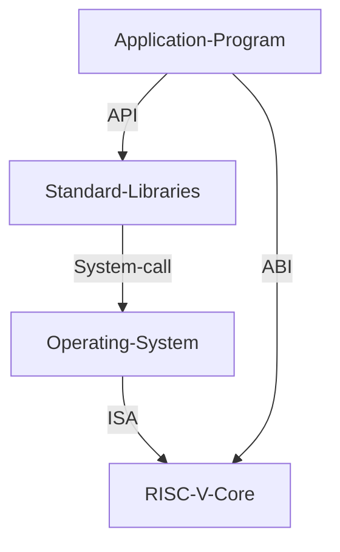
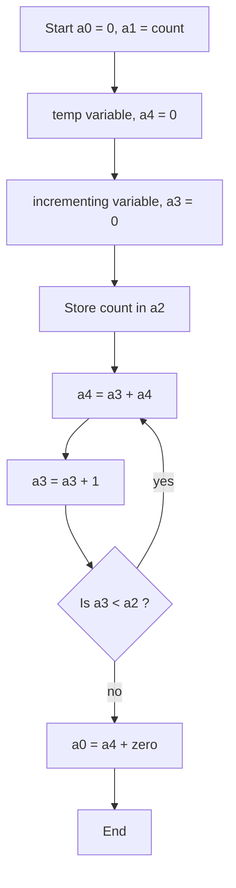

# Table of Contents

- [Table of Contents](#table-of-contents)
  - [Day 1 - Introduction to RISC - V ISA and GNU compiler toolchain](#day-1---introduction-to-risc---v-isa-and-gnu-compiler-toolchain)
    - [RISC - V ISA](#risc---v-isa)
      - [Intro to ISA](#intro-to-isa)
      - [Types of instruction](#types-of-instruction)
    - [Lab for software toolchain](#lab-for-software-toolchain)
      - [C Program to compute Sum from 1 to N](#c-program-to-compute-sum-from-1-to-n)
        - [C code](#c-code)
        - [Command to execute](#command-to-execute)
      - [gcc compiler and dissassemble](#gcc-compiler-and-dissassemble)
        - [Normal speed](#normal-speed)
        - [Fast](#fast)
      - [Spike simulation and debug](#spike-simulation-and-debug)
        - [Debugging](#debugging)
    - [Number systems](#number-systems)
      - [64-bit Number system](#64-bit-number-system)
      - [2's Complement representation](#2s-complement-representation)
      - [Lab for signed and unsigned magnitude](#lab-for-signed-and-unsigned-magnitude)
  - [Day 2 - Application Binary Interface and Verification flow](#day-2---application-binary-interface-and-verification-flow)
    - [Application Binary Interface (ABI)](#application-binary-interface-abi)
      - [Intro to ABI](#intro-to-abi)
      - [Memory Allocation for double words](#memory-allocation-for-double-words)
      - [Load, Add and Store instructions](#load-add-and-store-instructions)
      - [RV64I registers and their ABI Names](#rv64i-registers-and-their-abi-names)
    - [Labs using ABI function call](#labs-using-abi-function-call)
      - [Sum of N numbers Flowchart](#sum-of-n-numbers-flowchart)
      - [Assembly Function Call](#assembly-function-call)
        - [Assembly code for the sum of N](#assembly-code-for-the-sum-of-n)
        - [C program to call the assembly code](#c-program-to-call-the-assembly-code)
        - [Compiling through a RISC-V core](#compiling-through-a-risc-v-core)
    - [Passing the C program as a HEX file](#passing-the-c-program-as-a-hex-file)
  - [Day 3 - Digital Logic with TL-Verilog and Makerchip](#day-3---digital-logic-with-tl-verilog-and-makerchip)
    - [Combinational Logic](#combinational-logic)
      - [Labs using Makerchip](#labs-using-makerchip)
        - [Pipelined Pythagorean Example](#pipelined-pythagorean-example)
        - [Basic Logic Gates Example](#basic-logic-gates-example)
        - [Vectors](#vectors)
        - [Mux_2x1](#mux_2x1)
        - [Combinational Calculator](#combinational-calculator)
    - [Sequential Logic](#sequential-logic)
      - [Finite State Machine](#finite-state-machine)
      - [Fibonacci Series implmenetation](#fibonacci-series-implmenetation)
      - [Up-counter implementation](#up-counter-implementation)
      - [Sequential Calculator](#sequential-calculator)
    - [Pipelined Logic](#pipelined-logic)
      - [Intro to Pipelining and Re - timing](#intro-to-pipelining-and-re---timing)
        - [Re-timing](#re-timing)
      - [Benefits of pipelining](#benefits-of-pipelining)
      - [Pipelined fibo series implementation](#pipelined-fibo-series-implementation)
      - [Error Conditions within Computation Pipeline](#error-conditions-within-computation-pipeline)
      - [2-Cycle Calculator](#2-cycle-calculator)
    - [Validity](#validity)
      - [Intro to validity](#intro-to-validity)
        - [Clock Gating](#clock-gating)
      - [Lab on validity and computing total distance](#lab-on-validity-and-computing-total-distance)
      - [2-cycle Calculator with Validity](#2-cycle-calculator-with-validity)
      - [Calculator single-value Memory](#calculator-single-value-memory)
  - [Day 4 - Micro-architecture of a Single Cycle RISC - V Core](#day-4---micro-architecture-of-a-single-cycle-risc---v-core)
    - [Intro to Microarchitecture](#intro-to-microarchitecture)
      - [Micro-architecture](#micro-architecture)
      - [Basic Instruction-Execution Cycle](#basic-instruction-execution-cycle)
    - [Fetch and Decode](#fetch-and-decode)
      - [Program Counter Implementation](#program-counter-implementation)
      - [Fetch Stage Implementation](#fetch-stage-implementation)
      - [Decoding instruction type](#decoding-instruction-type)
      - [Immediate Decode](#immediate-decode)
      - [Instruction Decode](#instruction-decode)
      - [Validity in Instruction decode](#validity-in-instruction-decode)
      - [Determining individual instruction](#determining-individual-instruction)
    - [Control Logic](#control-logic)
      - [Register File Read](#register-file-read)
      - [ALU Decoder](#alu-decoder)
      - [Register File Write](#register-file-write)
      - [Branch Decisions](#branch-decisions)
      - [Branch to Target](#branch-to-target)
    - [Verification](#verification)
  - [Day 5 - Pipelined RISC-V Core](#day-5---pipelined-risc-v-core)
    - [Intro to Pipelining](#intro-to-pipelining)
    - [Pipelining the CPU](#pipelining-the-cpu)
      - [3 - Cycle Valid Signal](#3---cycle-valid-signal)
      - [Invalid Instructions](#invalid-instructions)
      - [Re-Timing](#re-timing-1)
    - [Solving Hazards](#solving-hazards)
      - [RAW Hazard](#raw-hazard)
      - [Branch Hazards](#branch-hazards)
      - [Remaining Instruction Decode](#remaining-instruction-decode)
      - [Complete ALU](#complete-alu)
    - [Loads/Stores](#loadsstores)
      - [Implementing loads and Redirecting](#implementing-loads-and-redirecting)
      - [Valid Loads](#valid-loads)
      - [Instantiate Data Memory](#instantiate-data-memory)
      - [Testing Loads/Stores](#testing-loadsstores)
      - [Jumps](#jumps)
      - [Final Work](#final-work)
  - [Acknowledgements](#acknowledgements)

## Day 1 - Introduction to RISC - V ISA and GNU compiler toolchain

### RISC - V ISA

#### Intro to ISA

- ISA describes the operations supported by a particular specification.

#### Types of instruction

- Pseudo Instructions - Move instructions
- RV64I - Integer
- RV64M _ Multiply
- RV64F, RV64D - Floating Point, Double Floating Point
- RV64-IMFD - All of the above

Application Binary Interface - System calls through which the programmers can access the registers of the RISC - V Core.

### Lab for software toolchain

#### C Program to compute Sum from 1 to N

##### C code

```c
#include <stdio.h>

int main () {
  int i = 0, sum = 0;
  int n = 10;
  for (i = 1; i < n; ++i) {
    sum += i;
  }
  
  printf("\nSum of numbers from 1 to %d = %d\n", n, sum);
  return 0;
}
```

##### Command to execute

```console
gcc sumofn.c -o sumofn
./sumofn
```


#### gcc compiler and dissassemble

- Now we run the compiled code in a test RISC - V Core

##### Normal speed

```console
riscv64-unknown-elf-gcc -O1 -mabi=lp64 -march=rv64i -o sumofn.o sumofn.c
riscv64-unknown-elf-objdump -d sumofn.o | less
```


Number of instructions = $(101ac-10184)/4 + 1 = 11$ instructions

##### Fast

```console
riscv64-unknown-elf-gcc -Ofast -mabi=lp64 -march=rv64i -o sumofn.o sumofn.c
riscv64-unknown-elf-objdump -d sumofn.o | less
```


#### Spike simulation and debug


This command is used for displaying the program after it gets executed by the RISC - V core.

```console
spike pk sumofn.o
```

Debug command

```console
spike pk -d sumofn.o

```

This command will run all the instructions until 100b0 Address

```console
until pc 0 100b0
```

This command is used for the checking the content of a register

```console
reg 0 a0
```

##### Debugging


- Here the value of the immediate 0x00021000 is loaded into the r0 register


- Here the value of stack pointer is decreased by -10 in hex.

### Number systems

#### 64-bit Number system

- 8 bits => 1 byte
- 4 bytes => 1 word
- 8 bytes => 2 words

Number of combinations using n bits => $2^n$

Highest number represented by 64-bit system => (2^64) - 1

#### 2's Complement representation

- Take 1's complement and then add +1.
- MSB indicates sign
- MSB = 0 indicates Positive Numbers
- MSB = 1 indicates Negative Numbers
- Range 0 to 2^63
- Range -1 to -2^63

#### Lab for signed and unsigned magnitude

- Highest unsigned long long number is $18446744073709551615$.


- Signed Numbers Max and Min


long long int occupies 8 bytes = $8 * 8 = 64 bits$

## Day 2 - Application Binary Interface and Verification flow

### Application Binary Interface (ABI)

#### Intro to ABI


- ABI is the system-call interface present between the software application and the registers of the ISA
- It can be used to access the registers through system calls



- There are 32 registers each of 64 bits in the RV64.

#### Memory Allocation for double words

- Memory is **byte-addressable**
- Each address contains 8 - bits (i.e.) - 1 byte
- RISC - V follows little-endian memory system.
- MSB bits have higher memory address and LSB have lower memory address

#### Load, Add and Store instructions

- Load - ld x8, 16(x23) - loads Memory[16+x23] into x8
- Add - x8, x24, x8
- Store - x8, 8(x23) - Store cotent of x8 into Memory[x23+8]

#### RV64I registers and their ABI Names

- Load, add and store belong to $RV64I$ base instructions.
- Load is a I-type instruction
- Add is a R-type instruction
- Store is a S-type instruction
- $rd$ is of size 5 bits => So $2^5 = 32$ registers
- Naming convention is $x0$ to $x31$

<!--  -->

### Labs using ABI function call

#### Sum of N numbers Flowchart



- Value of a0 is returned to the main program.

#### Assembly Function Call

##### Assembly code for the sum of N

```assembly
.section .text
.global load
.type load, @function

load:
  add a4, a0, zero // a4 - sum register
  add a2, a0, a1   // a2 - count register, n
  add a3, a0, zero // a3 - intermediate register, i
  
loop:
  add a4, a3, a4 // add a3 to a4 every loop
  add a3, a3, 1  // increment a3 by 1
  blt a3, a2, loop // loop back as long as i < n
  add a0, a4, zero // store result in a0
  ret  
```

##### C program to call the assembly code

```c
#include <stdio.h>

extern int load(int x, int y);

int main () {
 int result = 0;
 int count = 10;
 result = load(0x0, count+1);
 printf("Sum of numbers from 1 to %d is %d\n", count, result);
 return 0;
} 
```


##### Compiling through a RISC-V core

```console
riscv64-unknown-elf-gcc -Ofast -mabi=lp64 -march=rv64i -o sumof_N.o sumof_N.c load.S
spike pk sumof_N.o
```


### Passing the C program as a HEX file


```console
git clone https://github.com/kunalg123/riscv_workshop_collaterals.git
```

```console
chmod 377 rv32im.sh
./rv32im.sh
```

- The instructions that we want to run are passed as HEX files into the RISC - V core


## Day 3 - Digital Logic with TL-Verilog and Makerchip

### Combinational Logic

- Output depends only on the present input.
- No state is associated and no memory elements.

#### Labs using Makerchip

##### Pipelined Pythagorean Example


##### Basic Logic Gates Example

- Load Default template


```verilog
$reset = *reset;

$out1 = ~$in1;  // NOT
$out2 = $in1 || $in2; // bitwise - OR
$out3 = $in1 && $in2; // bitwise - AND
$out4 = $in1 ^ $in2; // bitwise - XOR
$out5 = ~($in1 ^ $in2); // bitwise - XNOR
```

##### Vectors

- Code

```verilog
$out[4:0] = $in1[3:0] + $in2[3:0];
```

- Output Waveform


##### Mux_2x1

- 2x1 Mux

```verilog
$out = $sel ? $in1 : $in0; // 2x1 MUX
```

- Output Waveform


- 2x1 Mux (vector)

```verilog
$out[7:0] = $sel ? $in1[7:0] : $in0[7:0]; // 2x1 MUX
```

- Output Waveform


##### Combinational Calculator

- Code

```verilog
   $reset = *reset;


   // YOUR CODE HERE
   $val1[31:0] = $rand1[3:0];
   $val2[31:0] = $rand2[3:0];

   $sum[31:0] = $val1 + $val2;  //00
   $diff[31:0] = $val1 - $val2; //01
   $prod[31:0] = $val1 * $val2; //10
   $quot[31:0] = $val1 / $val2; //11

   $out[31:0] = ($op[1:0] == 2'b00) ? $sum :
               ($op[1:0] == 2'b01) ? $diff :
               ($op[1:0] == 2'b10) ? $prod :
               ($op[1:0] == 2'b11) ? $quot : 32'b0;
```

- Output Waveform


### Sequential Logic

- Present state depends on past state.
- Memory is associated with sequential logic.
- It retains its value till a clock edge or (level comes).

#### Finite State Machine


#### Fibonacci Series implmenetation

- Code

```verilog
$num[31:0] = $reset ? 1 : (>>1$num + >>2$num);
```

- Output Waveform


#### Up-counter implementation

- Code

```verilog
$num[31:0] = $reset ? 0 : (>>1$num + 1);
```

- Output Waveform


#### Sequential Calculator

- Here the last output becomes one of the present input.

- Code

```verilog
   $reset = *reset;


   //$val1[31:0] = $rand1[3:0];
   $val2[31:0] = $rand2[3:0];

   //$num[31:0] = $reset ? 0 : (>>1$num + 1);

   $sum[31:0] = $out + $val2;  //00
   $diff[31:0] = $out - $val2; //01
   $prod[31:0] = $out * $val2; //10
   $quot[31:0] = $out / $val2; //11

   $tout[31:0] = ($op[1:0] == 2'b00) ? $sum :
                  ($op[1:0] == 2'b01) ? $diff :
                  ($op[1:0] == 2'b10) ? $prod :
                  ($op[1:0] == 2'b11) ? $quot : 32'b0;

   $out[31:0] = $reset ? 0 : >>1$tout;
```

- Output Waveform


### Pipelined Logic

#### Intro to Pipelining and Re - timing

- We divide the long combinational circuit into smaller parts by inserting registers.
- Each smaller part has less propagation delay.
- So now each stage can be executed at higher frequency.
- Pipelining allows us to overlap the execution of one instruction with the earlier stage of another instruction.
- It increases system response time, as we don't need to wait till the entire instruction is executed.

##### Re-timing

- We can move the flip flops to achieve equal delays in each stage.

#### Benefits of pipelining

- Max. frequency of the clock, depends on the propagation delay between flip flops.
- By inserting more flip flops, the propagation delay reduces
- It increases the throughtout

#### Pipelined fibo series implementation

- $lower_case: pipe signal
- $PascalCase: state signal
- $UPPER_CASE: keyword

- Everything in TL-Verilog is implicitly pipelined.
- This fibo implementation is equivalent to the earlier implementation.


#### Error Conditions within Computation Pipeline

- Code

```verilog
   $reset = *reset;

   //...
   |comp
      @1
         $err1 = $bad_input + $illegal_op;
         
      @3
         $err2 = $over_flow + $err1;
      @6
         $err3 = $div_by_zero + $err2;   
```

- Output Waveform
  


#### 2-Cycle Calculator

i. First we shall include the counter and calculator in the first stage.

<!--  -->

ii. Change alignment of $out to have two cycle latency

<!--  -->

iii. Change counter to 1 - bit

<!--  -->

iv. Use the counter as valid signal. The output gets the Mux output every two clock cycles.

<!--  -->

v. Now we re-time(move the mux) to second stage. The output gets the Mux output every other clock cycle.


- Code

```verilog
   |calc
      @0
         $reset = *reset;
         
      @1   
         //$val1[31:0] = $rand1[3:0];
         $val2[31:0] = $rand2[3:0];

         $valid = $reset ? 0 : (>>1$valid + 1);

         $sum[31:0] = $out + $val2;  //00
         $diff[31:0] = $out - $val2; //01
         $prod[31:0] = $out * $val2; //10
         $quot[31:0] = $out / $val2; //11   
         
         $out[31:0] = ($reset | ~($valid)) ? 0 : >>2$tout;
         
      @2
         $tout[31:0] = ($op[1:0] == 2'b00) ? $sum :
                     ($op[1:0] == 2'b01) ? $diff :
                     ($op[1:0] == 2'b10) ? $prod :
                     ($op[1:0] == 2'b11) ? $quot : 32'b0;
```

### Validity

#### Intro to validity

- Validity checks can be included in the design
- It is helpful in better debugging
- Leads to cleaner design

##### Clock Gating

- Toggling of the clock consumes lot of power
- Clock gating avoids toggling for invalid inputs

#### Lab on validity and computing total distance

- In this we compute the pythagorean distance and add it to the previous value.


#### 2-cycle Calculator with Validity

- In this implementation, the computation is carried out, only when the validity is enabled.

<details>

   <summary> Code </summary>

```verilog
   |calc
      @0
         $reset = *reset;
         
      @1   
         //$val1[31:0] = $rand1[3:0];
         $val2[31:0] = $rand2[3:0];

         $valid = $reset ? 0 : (>>1$valid + 1);
         
         $valid_or_reset = $valid || $reset;
         
      ?$valid_or_reset
         @1
            $out[31:0] = $reset ? 0 : >>2$tout;
            
            $sum[31:0] = $out + $val2;  //00
            $diff[31:0] = $out - $val2; //01
            $prod[31:0] = $out * $val2; //10
            $quot[31:0] = $out / $val2; //11               

         @2
            $tout[31:0] = ($op[1:0] == 2'b00) ? $sum :
                        ($op[1:0] == 2'b01) ? $diff :
                        ($op[1:0] == 2'b10) ? $prod :
                        ($op[1:0] == 2'b11) ? $quot : 32'b0;
```

</details>

- Output Waveform


#### Calculator single-value Memory

- We can implement a memory system using a Mux that has a feedback path.
- op = 100 => memory read (recall)
- op = 101 => memory write

<details>
   <summary> Code </summary>

```verilog
   |calc
      @0
         $reset = *reset;

      @1   
         //$val1[31:0] = $rand1[3:0];
         $val2[31:0] = $rand2[3:0];

         $valid = $reset ? 0 : (>>1$valid + 1);
         
         $valid_or_reset = $valid || $reset;
         
      ?$valid_or_reset
         @1
            $out[31:0] = $reset ? 0 : >>2$tout;
            
            $sum[31:0] = $out + $val2;  //00
            $diff[31:0] = $out - $val2; //01
            $prod[31:0] = $out * $val2; //10
            $quot[31:0] = $out / $val2; //11   
            
            
         @2
            // op = 100 => memory read
            // op = 101 => memory write
            
            // memory
            $mem[31:0] = $reset ? 0 :
                                  ($op[2:0] == 3'b101) ? >>2$tout :
                                  >>2$mem;

            $tout[31:0] = ($op[2:0] == 3'b000) ? $sum :
                        ($op[2:0] == 3'b001) ? $diff :
                        ($op[2:0] == 3'b010) ? $prod :
                        ($op[2:0] == 3'b011) ? $quot :
                        ($op[2:0] == 3'b100) ? >>2$mem : >>2$tout;
```

</details>


- Here at the 32th clock cycle, we are writing the value ffd into the memory.


- It take 2 cycles to write.

## Day 4 - Micro-architecture of a Single Cycle RISC - V Core

### Intro to Microarchitecture

#### Micro-architecture

- A Micro-architecture is an implementation of an ISA.
- A Single ISA can have multiple Mirco-architectures.
- We shall implement the below micro-architecture in TL-Verilog

#### Basic Instruction-Execution Cycle

- **Fetch** the Instruction pointed by the PC from the Instruction Memory.
- **Decode** the the Instruction
- **Execute** the instruction (ALU)
- Perform **Memory Access** if needed (Data Memory)
- **Write Back** the result into the Register File


### Fetch and Decode

#### Program Counter Implementation

- Increments by +4 bytes every clock cycle.
- Resets to 0 at the next clock cycle, if reset instruction is asserted.

```verilog
   |cpu
      @0
         $reset = *reset;      
         $pc[31:0] = (>>1$reset) ? 32'b0 : >>1$pc + 32'd4;
```


#### Fetch Stage Implementation

```verilog
   |cpu
      @0
         $reset = *reset;
      // YOUR CODE HERE
      // ...
      
         $pc[31:0] = (>>1$reset) ? 32'b0 : >>1$pc + 32'd4;
         $imem_rd_en = ~($reset);
      
      @1
      ?$imem_rd_en
         @1
            $imem_rd_addr[31:0] = $pc[M4_IMEM_INDEX_CNT+1:2];
      
      @1   
         $instr[31:0] = $imem_rd_data[31:0];
```


#### Decoding instruction type


#### Immediate Decode


- Based on the instruction type, we need to form the immediate.


#### Instruction Decode

- Similiary, we can extract other fields of information


#### Validity in Instruction decode

- Now add validity checks when extract the fields


#### Determining individual instruction

- Using funct7, opcode and funct3 decode each type of instruction


### Control Logic

#### Register File Read


- When rs1, rs2 needed we can enable register read and provide the location of the source regsiters.
- By checking r-type and i-type we can check whether this is correct.


#### ALU Decoder


#### Register File Write

- We cannot write to r0 register.


#### Branch Decisions

- We take a branch only if it is branch instruction and condition is true.


#### Branch to Target

- We modify the PC Mux to take a branch when the previous instruction is a branch instruction (taken branch)


### Verification

```verilog
*passed = |cpu/xreg[10]>>5$value == (1+2+3+4+5+6+7+8+9);
```

- The design successfully produces the sum!


- This is the final image for day 4.
  


## Day 5 - Pipelined RISC-V Core

### Intro to Pipelining


### Pipelining the CPU

#### 3 - Cycle Valid Signal

- We insert a new instruction every third cycle to avoid hazards


#### Invalid Instructions

- Avoid writing RF for invalid instructions
- Avoid redirecting PC for invalid intructions


- But it takes 100 clock cycles

#### Re-Timing


### Solving Hazards

#### RAW Hazard

- If Source register is equal to destination register of previous instruction, use bypass


#### Branch Hazards


- We have wait to till @3 stage (4th Stage), to tell whether branch is taken or not.
- We can use a branch predictor but it is difficult to implement.
- So, we will not allow the next two instructions to write to register file whenever branch is detected


#### Remaining Instruction Decode

- We consider all loads as same for simplicity.


#### Complete ALU

- We implement the remaining two instructions


### Loads/Stores

#### Implementing loads and Redirecting

- Load - Loading from Data Memory into the Register file


- We have to wait till the end of execute stage to obtain the valid load data.
- So, we have to flush the next two instructions
- We then forward the result.

#### Valid Loads

- When there is valid load two cycles ago, we can enable the write pin for the register
- We also add a Mux for selecting between load and ALU Writes


#### Instantiate Data Memory

- Now uncomment macro of data memory
- Connect the interface signals


#### Testing Loads/Stores


- The test is successfully passed.

#### Jumps

- Jumps are unconditional branches
- JAL => jump to PC + imm
- JALR => src1 + imm


#### Final Work

- Thus a Five Stage Pipelined RISC - V Core of RV64I is successfully designed and verified.


## Acknowledgements

[1] Kunal Ghosh - Founder, VSD

[2] Steve Hoover - Founder, RedWood EDA

[3] Shon Taware - Teaching Assistant, VSD

[4] VSD Team


